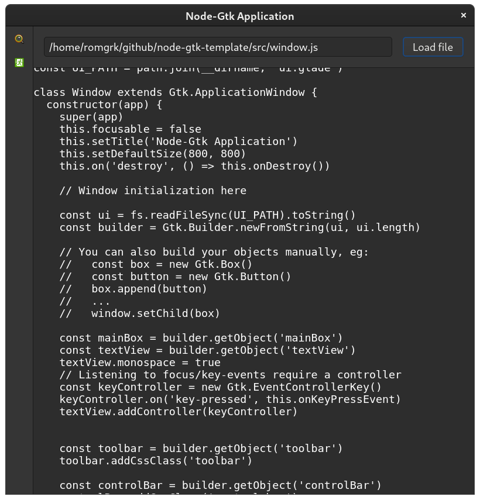
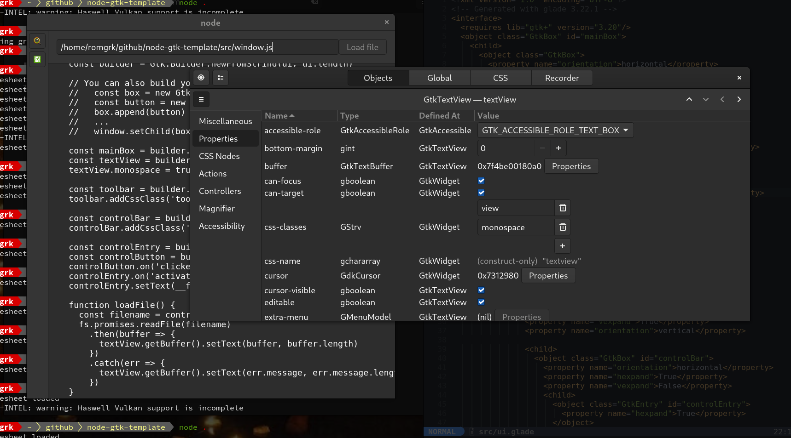

# node-gtk-template

This is a node-gtk application template. Use it as a base for your own project.

  

# Development

Developping a node-gtk application requires you to understand the Gtk documentation,
be sure to read the following resources:
 - https://github.com/romgrk/node-gtk/blob/master/doc/index.md
 - https://developer.gnome.org/gtk4/stable/
 - https://developer.gnome.org/gtk4/4.0/css.html

### Stylesheet

The application stylesheet is at `./src/style.css`. If `NODE_ENV` is not `production`,
it will auto-reload whenever you change it.

### Elements

You can open the elements inspector (similar to browsers' devtools) with <kbd>Ctrl-Shit-D</kbd>.

  

